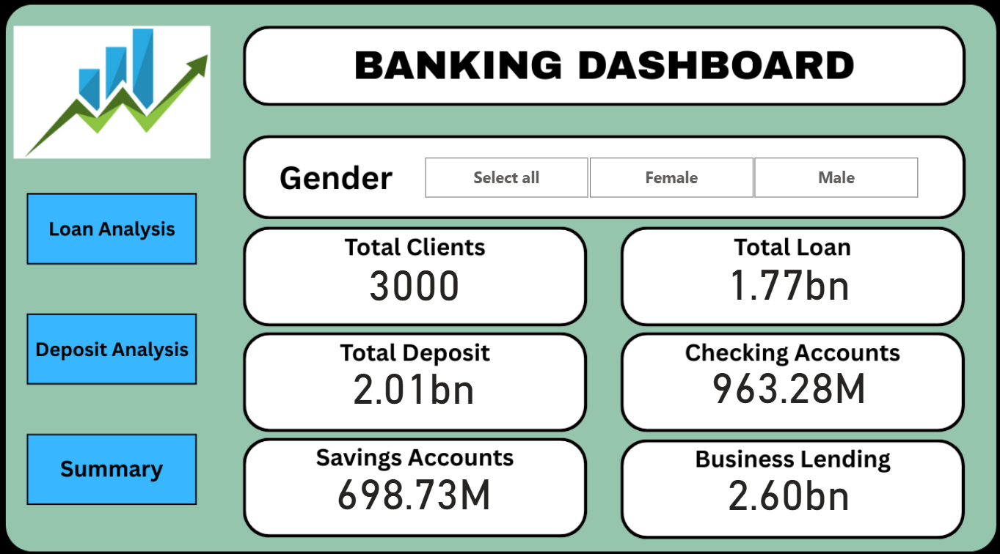
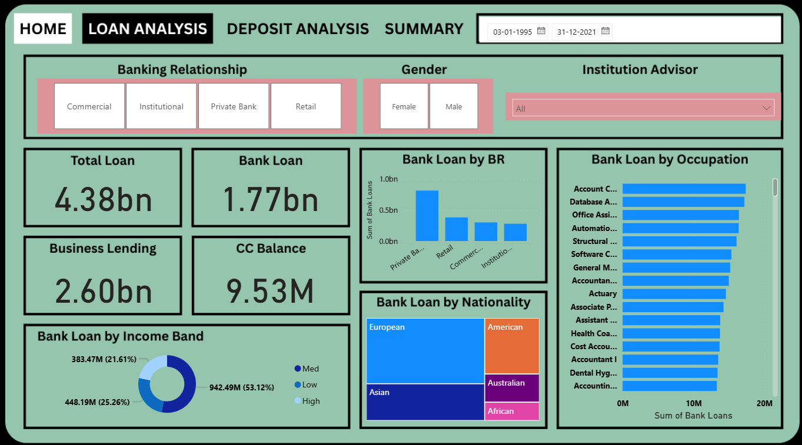
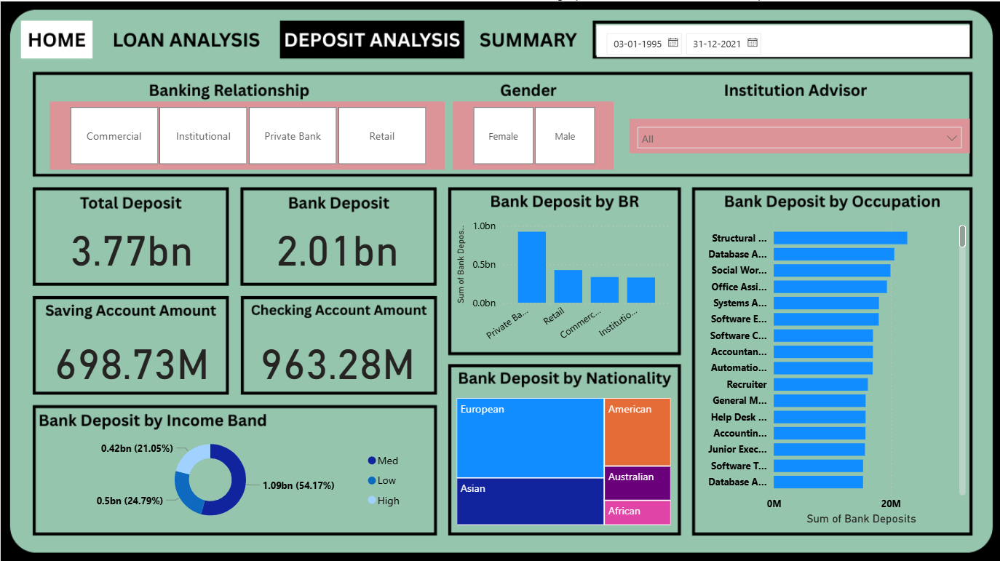
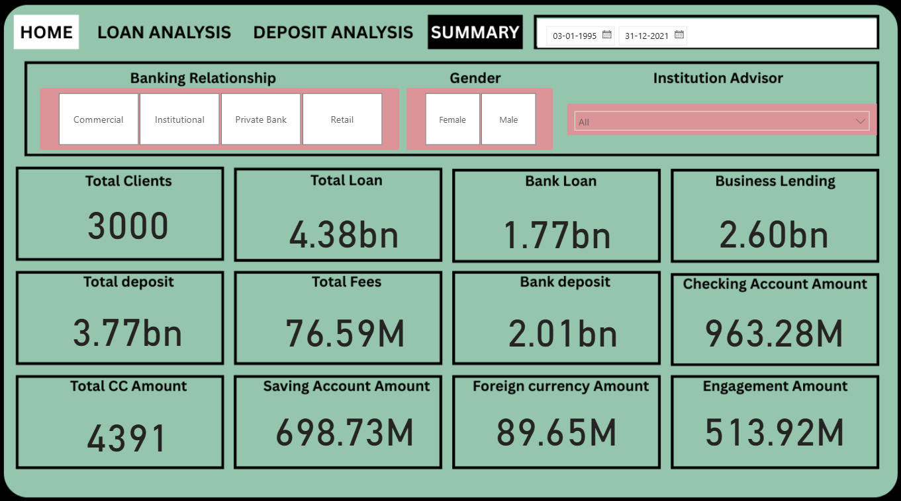

# Banking Dashboard 

## Overview

This repository contains an interactive Banking Dashboard developed using Power BI. The dashboard provides comprehensive insights into banking operations, including loan analysis, deposit analysis, client information, and overall financial performance metrics.

The project is designed to help analyze banking data efficiently through dynamic visualizations, KPI tracking, and interactive filtering options.

---

## Dashboard Modules

### Home Dashboard

The home page provides a high-level overview of banking performance with key financial indicators such as:

- Total Clients
- Total Loan Amount
- Total Deposits
- Savings Accounts
- Checking Accounts
- Business Lending

It also includes interactive filters based on:
- Gender
- Banking Relationship
- Institution Advisor

---

### Loan Analysis Dashboard

The Loan Analysis section focuses on loan-related insights, including:

- Total Loan Distribution
- Business Lending Analysis
- Credit Card Balance Overview
- Loan Analysis by Banking Relationship
- Loan Analysis by Occupation
- Loan Analysis by Nationality
- Income Band Analysis

This dashboard helps identify customer borrowing patterns and loan performance across different customer segments.

---

### Deposit Analysis Dashboard

The Deposit Analysis dashboard provides insights into customer deposit behavior and account analysis, including:

- Total Deposits
- Bank Deposits
- Savings Account Amount
- Checking Account Amount
- Deposit Analysis by Occupation
- Deposit Analysis by Nationality
- Deposit Analysis by Banking Relationship
- Income Band Deposit Distribution

This module enables better understanding of customer deposit trends and financial engagement.

---

### Summary Dashboard

The Summary section presents consolidated banking KPIs in a single view, including:

- Total Clients
- Total Loan
- Total Deposits
- Bank Loan
- Bank Deposit
- Business Lending
- Total Fees
- Foreign Currency Amount
- Engagement Amount
- Total CC Amount
- Savings Account Amount
- Checking Account Amount

This dashboard provides a complete snapshot of banking operations and overall business performance.

---

## Features

- Interactive Power BI Dashboard
- Dynamic Filters and Slicers
- Financial KPI Monitoring
- Customer Segmentation Analysis
- Occupation & Nationality Insights
- Banking Relationship Analysis
- Loan & Deposit Tracking
- User-Friendly Interface

---

## Tools & Technologies Used

- Power BI
- DAX
- Power Query
- Data Modeling
- Data Visualization

---

## Project File

- Banking Dashboard OTC.pbix

---

## Insights Generated

- Customer banking behavior analysis
- Deposit and loan trend analysis
- Business lending performance tracking
- Occupation-wise financial distribution
- Nationality-based banking insights
- Gender-based banking analysis

---

## Author

**Shreyansh Patel**  

- 📧 Email: 17Shreyanshpatel@gmail.com  
- 🔗 LinkedIn: https://linkedin.com/in/shreyanshpatel17  
